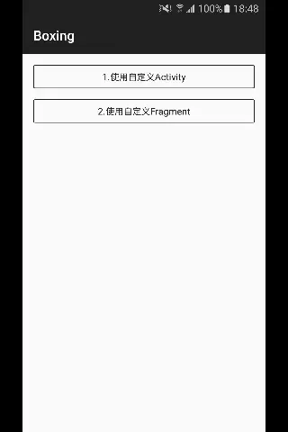

## boxing
---
Android multi-media selector based on MVP mode.[中文文档](README_CN.md)  [](https://travis-ci.org/Bilibili/boxing)

#### boxing Inside: 
[](https://play.google.com/store/apps/details?id=tv.danmaku.bili)

### Feature
---
- Custom UI
- Multiple/single selection, preview and crop function
- Gif support
- Video selection
- Image compression

### Download
---
Core version: only contain the core function.

UI version: contain UI implements base on core version.

- Maven

Core version

```xml
<dependency>                       
  	<groupId>com.bilibili</groupId>  
  	<artifactId>boxing</artifactId>  
  	<version>0.7.5</version>
  	<type>pom</type>                
</dependency>                      		
```

UI version

```xml
<dependency>                          
  	<groupId>com.bilibili</groupId>     
  	<artifactId>boxing-impl</artifactId>
  	<version>0.7.5</version>   
  	<type>pom</type>                    
</dependency>                         
```

- Gradle

Core version              
```java
compile 'com.bilibili:boxing:0.7.5'
```

UI version
```java
compile 'com.bilibili:boxing-impl:0.7.5'
```

### Preview




### Getting Started

- Media loading initialization(required)
```java
BoxingMediaLoader.getInstance().init(new IBoxingMediaLoader()); // a class implements IBoxingMediaLoader 
```

- Image cropping initialization(optional)
```java
BoxingCrop.getInstance().init(new IBoxingCrop());  // a class implements IBoxingCrop 
```
- Build BoxingConfig
  Specify the mode(Mode.SINGLE_IMG, Mode.MULTI_IMG, Mode.VIDEO) with camera and gif support. 
```java
BoxingConfig config = new BoxingConfig(Mode); // Mode：Mode.SINGLE_IMG, Mode.MULTI_IMG, Mode.VIDEO
config.needCamera(cameraRes).needGif().withMaxCount(9) // camera, gif support, set selected images count
.withMediaPlaceHolderRes(resInt) // set the image placeholder, default 0
.withAlbumPlaceHolderRes(resInt) // set the album placeholder, default 0
.withVideoDurationRes(resInt) // set the video duration resource in video mode, default 0
```
- Get Boxing, set Intent and call start
```java
// start thumbnails Activity, need boxing-impl.
Boxing.of(config).withIntent(context, BoxingActivity.class).start(callerActivity, REQUEST_CODE); 
  	
// start view raw image Activity, need boxing-impl.
Boxing.of(config).withIntent(context, BoxingViewActivity.class).start(callerActivity, REQUEST_CODE); 
  	
// call of() use Mode.MULTI_IMG by default.
Boxing.of().withIntent(context, class).start(callerActivity, REQUEST_CODE);
```
- Get Result
```java
@Override
protected void onActivityResult(int requestCode, int resultCode, Intent data) {
  	List<BaseMedia> medias = Boxing.getResult(data);
  	// avoid null
}
```
### Advanced usage
Media loading and image cropping initialization are the same as Simple Usage.

- Customize Activity and Fragment
  Extends AbsBoxingViewActivity and AbsBoxingViewFragment.
  call `Boxing.of(config).withIntent(context, AbsBoxingViewActivity.class).start(callerActivity, REQUEST_CODE);` to start.

- Only customize Fragment
  Extends AbsBoxingViewFragment,no AbsBoxingViewActivity.
  call `Boxing.of(BoxingConfig).setupFragment(AbsBoxingViewFragment, OnFinishListener);` to start.


### FileProvider                                                                                   
Use camera in Android N, add this in AndroidManifest.xml                                                        
```xml
<provider                                                 
	android:name="android.support.v4.content.FileProvider"
	android:authorities="${applicationId}.file.provider" >               
	<meta-data                                            
		android:name="android.support.FILE_PROVIDER_PATHS"
		android:resource="@xml/boxing_file_provider"/>
</provider>                 
```

### TODO
Support different config at the same moment.

### License
----
Copyright 2017 Bilibili
Licensed under the Apache License, Version 2.0 (the "License"); you may not use this file except in compliance with the License. You may obtain a copy of the License at
[http://www.apache.org/licenses/LICENSE-2.0](http://www.apache.org/licenses/LICENSE-2.0)
Unless required by applicable law or agreed to in writing, software distributed under the License is distributed on an "AS IS" BASIS, WITHOUT WARRANTIES OR CONDITIONS OF ANY KIND, either express or implied. See the License for the specific language governing permissions and limitations under the License.